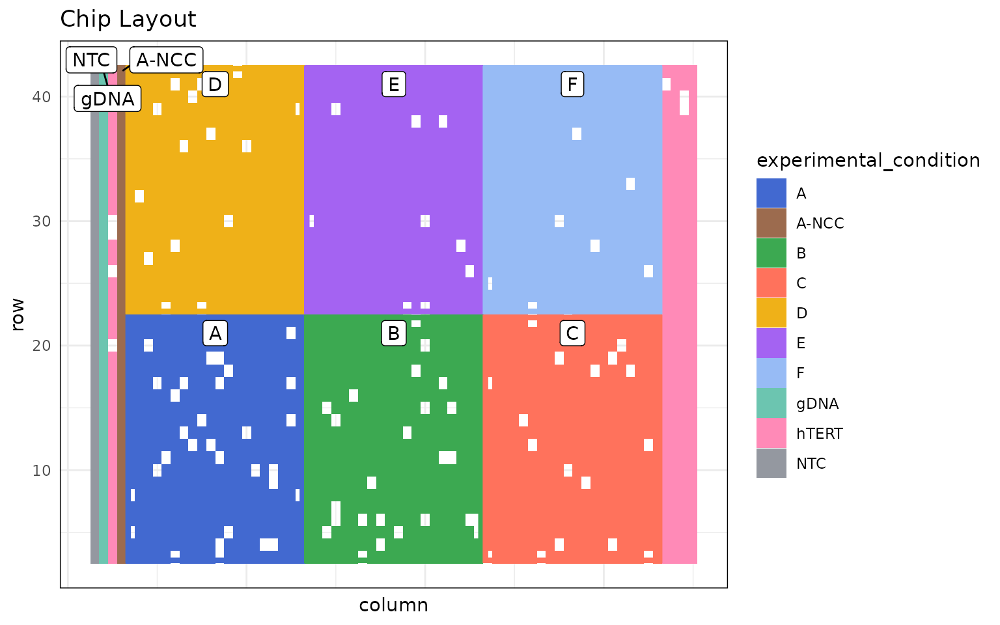
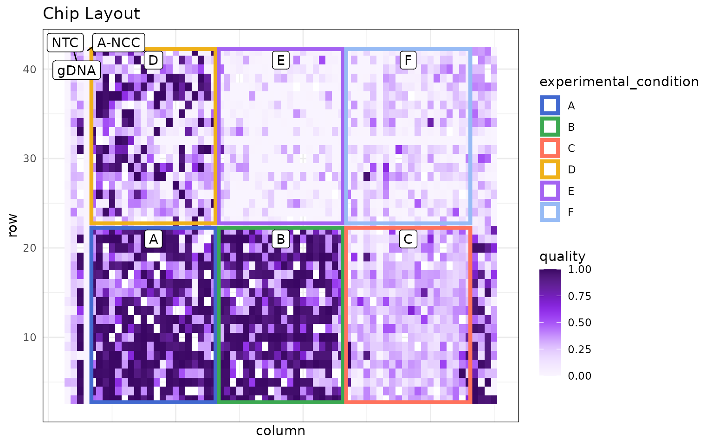
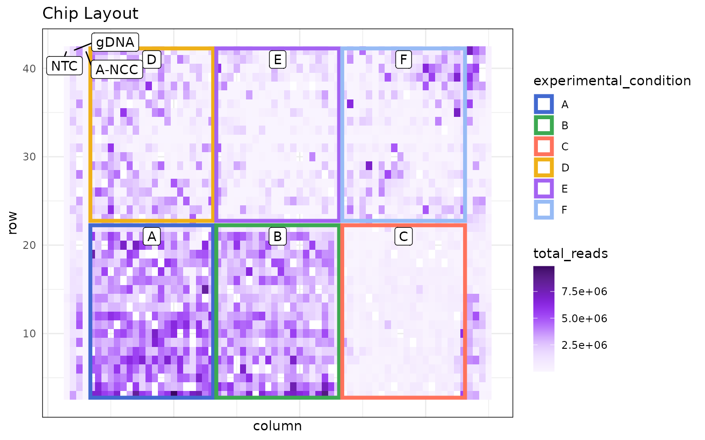
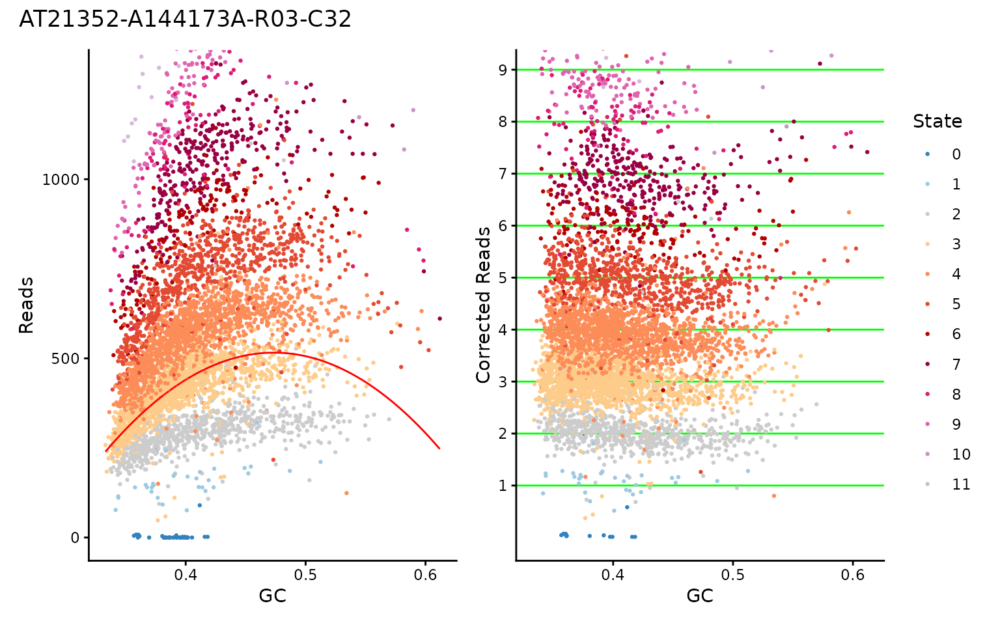
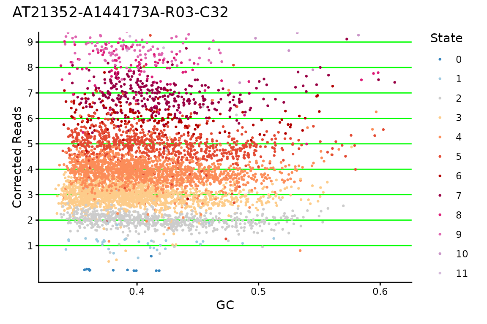
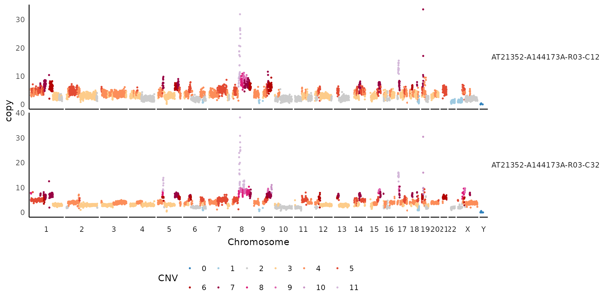
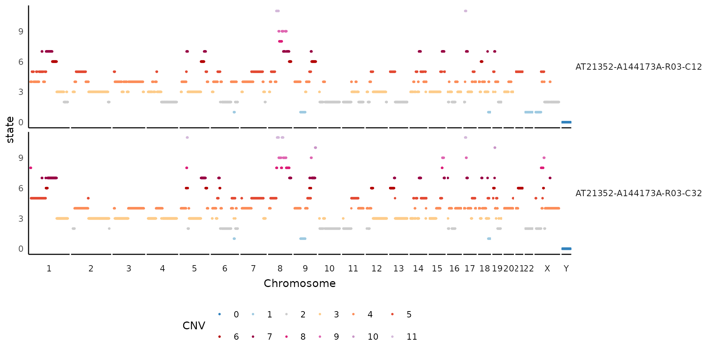
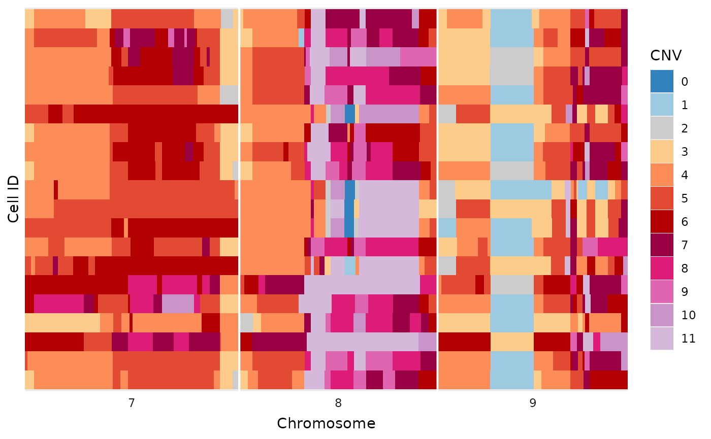

# Basic Exploratory Plots

``` r
library(dlptools)
```

Most of the plots here related to exploring aspects of a DLP run to help
learn how well it may have worked or not!

A good resource of exploring aspects of DLP are these confluence pages:

- [DLP Library Analysis
  Basics](https://molonc.atlassian.net/wiki/spaces/SOFT/pages/2702082064/DLP+Library+Analysis+Basics)
- [Comparison of SCP and
  Mondrian](https://molonc.atlassian.net/wiki/spaces/SOFT/pages/2473459715/DLP+pipeline+comparison+scp+vs+mondrian)
- [Explanation of Metrics
  Columns](https://molonc.atlassian.net/wiki/spaces/SOFT/pages/2459041795)

## Chip Layout Plots

The first thing we usually want to check, is how the chip is laid out:

``` r
# just some example data from a recent run with lots of experimental conditions
ex_mets <- vroom::vroom(
  "data/ex_metrics.tsv.gz",
  show_col_types = FALSE
)

dlptools::plot_dlp_chip(ex_mets, "experimental_condition")
```



  
  

Then often we want to look for spatial effects across the chip.

Such as, quality:

``` r
dlptools::plot_dlp_chip(ex_mets, "quality")
```



  
  

or perhaps total reads:

``` r
dlptools::plot_dlp_chip(ex_mets, "total_reads")
```



  
  

## GC Correction Plots

Another plot that can be useful is to look at the GC correction for a
cell, to see if the values really fall on integers for CNs, or if maybe
something seems off about the multiplier HMMcopy chose for the cell.

``` r
# standard reads table, really anything with GC, modal_curve, multiplier, and
# cell_id columns should work.
ex_reads <- vroom::vroom(
  "data/example_full_reads.tsv.gz",
  show_col_types = FALSE
)

dlptools::plot_gc(
  ex_reads,
  cellid = "AT21352-A144173A-R03-C32",
  # plot_choice = "both" # the default option
)
```



  

Or you can just plot one:

``` r
dlptools::plot_gc(
  ex_reads,
  cellid = "AT21352-A144173A-R03-C32",
  plot_choice = "corrected" # or plot_choice = "raw"
)
```



  
  
  

## Cell Copy Profiles

Sometimes you want to show a plot of a cell, or handful of cells, with
their copy values and the overlaid state calls.

The Signals package has
[plotCNprofile](https://shahcompbio.github.io/signals/reference/plotCNprofile.html)
which has lots of features.

But if you want a quick and dirt dlptools version, you can do:

``` r
dlptools::plot_cell_cn_profile(
  ex_reads,
  cell_ids = unique(ex_reads$cell_id)[1:2],
  # high copy numbers can obscure the plot, so you can set:
  # pseduo_log_y = TRUE
  # and that might help. Or see function help for more ideas
)
```



  
  
  

If needed, can also change what the y-axis is to other bin-based
options:

``` r
dlptools::plot_cell_cn_profile(
  ex_reads,
  cell_ids = unique(ex_reads$cell_id)[1:2],
  yaxis = "state"
)
```



  
  
  

### Simplified Tile Plot

This plot is a simplified alternative to the methods described in [the
heatmaps
vignette](https://molonc.github.io/dlptools/articles/heatmaps.html).
There are no additions, like trees and annotations, but works for a
variety of quick inspections.

``` r
dlptools::plot_read_bins_basic(
  # just filtering to make the plot smaller for this demonstration
  dplyr::filter(ex_reads, chr %in% c(7:9))
)
```



To help with plotting, a variety of commonly use color palettes are
available:

``` r
# standard state colors
dlptools::CNV_COLOURS
#>         0         1         2         3         4         5         6         7 
#> "#3182BD" "#9ECAE1" "#CCCCCC" "#FDCC8A" "#FC8D59" "#E34A33" "#B30000" "#980043" 
#>         8         9        10       11+        11 
#> "#DD1C77" "#DF65B0" "#C994C7" "#D4B9DA" "#D4B9DA"

# typically used allele specific colors
dlptools::ASCN_COLORS
#>       0|0       1|0       1|1       2|0       2|1       3|0       2|2       3|1 
#> "#3182BD" "#9ECAE1" "#CCCCCC" "#666666" "#FDCC8A" "#FEE2BC" "#FC8D59" "#FDC1A4" 
#>       4|0         5         6         7         8         9        10        11 
#> "#FB590E" "#E34A33" "#B30000" "#980043" "#DD1C77" "#DF65B0" "#C994C7" "#D4B9DA" 
#>       11+ 
#> "#D4B9DA"

# typically used phase colors
dlptools::ASCN_PHASE_COLORS
#>     A-Hom     B-Hom  A-Gained  B-Gained  Balanced 
#> "#56941E" "#471871" "#94C773" "#7B52AE" "#d5d5d4"

# typically BAF scale is a circlize::colorRamp2 spanning
# standard green-grey-purple used for ASCN colors
# dlptools::BAF_COLORS
```

  
  
