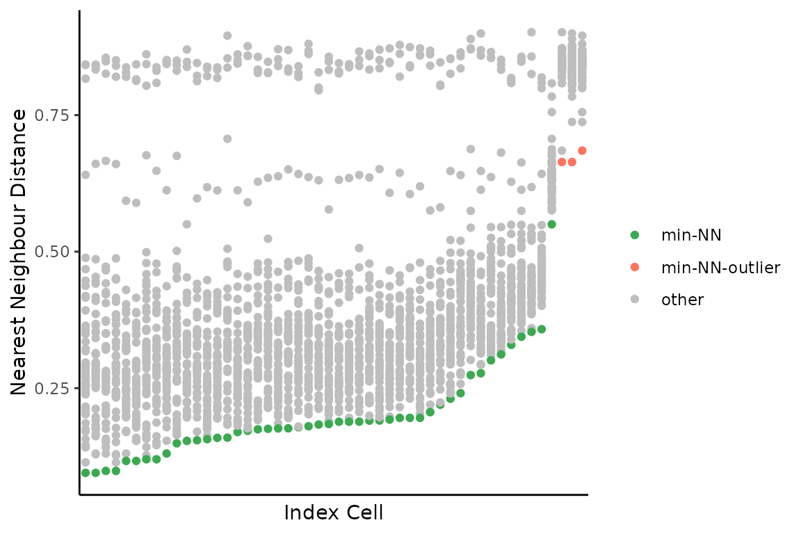

# Pairwise Differences Between Cells

``` r
library(dlptools)
```

The functions here were inspired by a paper called: *Genomic evolution
and cellular states of whole-genome doubling in ovarian cancer.* By
Weiner et al. 2025, some folks at MSKCC.

The basic idea is to count the numbers of bins that are different in
state between two cells, divided by the number of bins considered. Then
we can do things like fit a beta distribution to identify outliers, or
do other clustering to find groups of similar/different cells, etc.

These functions will make that a bit easier.

First some toy data:

``` r
reads_df <- vroom::vroom("data/example_reads.tsv.gz", show_col_types = FALSE)

# only using a few cells to demonstrate functions below
targ_cells <- unique(reads_df$cell_id)[1:50]

reads_df <- dplyr::filter(reads_df, cell_id %in% targ_cells)

# standard reads dataframe of bin based state calls
dplyr::slice_head(reads_df, n = 5)
#> # A tibble: 5 × 11
#>   cell_id                chr    start   end state     gc ideal   map reads valid
#>   <chr>                  <chr>  <dbl> <dbl> <dbl>  <dbl> <lgl> <dbl> <dbl> <lgl>
#> 1 AT23998-A138956A-R03-… 1     1   e0 5  e5     4 -1     FALSE 0.349    55 FALSE
#> 2 AT23998-A138956A-R03-… 1     5.00e5 1  e6     4 -1     FALSE 0.770   224 FALSE
#> 3 AT23998-A138956A-R03-… 1     1.00e6 1.5e6     4  0.598 FALSE 0.982   342 TRUE 
#> 4 AT23998-A138956A-R03-… 1     1.50e6 2  e6     4  0.539 TRUE  0.963   282 TRUE 
#> 5 AT23998-A138956A-R03-… 1     2.00e6 2.5e6     4  0.595 TRUE  0.997   385 TRUE 
#> # ℹ 1 more variable: is_low_mappability <lgl>
```

  
  

Now, we can measure pairwise distances between all cells. This involves:

1.  generating all pairwise cell comparisons
2.  aligning bins for each pair
3.  collapsing runs of bins based on *matched* and *unmatched* states
    between the cell pair – aka segmenting on state matches
4.  filtering small runs (segments) of matches or non-matches
5.  re-binning the runs
6.  counting number of non-matching bins, divided by total number of
    bins still considered
7.  presenting the results for each cell and it’s distances to all other
    cells

  

Warning, this function is *slow*, and the number of pairwise comparisons
grows with more cells. E.g., 100 cells is 4950 comparisons and takes a
couple minutes. There is definitely room for improvement here.

Parallelizing will make your life a bit better. Internally, this
function uses `furrr`, you just need to set up a plan.

``` r
# first set up a parallel plan, here with 4 cores being used
future::plan(future::multicore, workers = 4)

pairwise_diffs <- dlptools::pairwise_bin_difference(
  reads_df,
  # min_seg_length = 2.5e6 # see function documentation. It's the minimum
  # length of a stretch of matching/unmatching bins to consider.
)
#> [1] "comparing all cells. Gonna take some time."
#> [1] "processing: 1225 pairs"

dplyr::slice_head(pairwise_diffs, n = 5)
#> # A tibble: 5 × 6
#>   n_diff tot_bins prop_diff index_cell               comp_cell nearest_neighbour
#>    <int>    <int>     <dbl> <chr>                    <chr>     <lgl>            
#> 1   2214     6144     0.360 AT23998-A138956A-R03-C34 AT23998-… FALSE            
#> 2   2286     6135     0.373 AT23998-A138956A-R03-C34 AT23998-… FALSE            
#> 3   2212     6151     0.360 AT23998-A138956A-R03-C34 AT23998-… FALSE            
#> 4   1972     6141     0.321 AT23998-A138956A-R03-C34 AT23998-… FALSE            
#> 5   2811     6151     0.457 AT23998-A138956A-R03-C34 AT23998-… FALSE
```

which is each cell (`index cell`) compared to each other cell
(`comp_cell`) and some information on the proportion of bins different
(`prop_diff`).

The `nearest_neighbour` column is a boolean where the nearest neighbour
of each cell is marked as TRUE.

  
  
  

------------------------------------------------------------------------

**Side Note**

The function
[`dlptools::pairwise_bin_difference()`](https://molonc.github.io/dlptools/reference/pairwise_bin_difference.md)
has a `cells` parameter. Leaving it empty, the default, compares all
cells in a pairwise manner.

This will compare this one cell against all others:

``` r
dlptools::pairwise_bin_difference(
  reads_df,
  cells = "some_cell_id"
)
```

Alternatively, specifying two or more cells will just compared the
specified cells to each other:

``` r
dlptools::pairwise_bin_difference(
  reads_df,
  cells = c("cell_id_one", "cell_id_two", "cell_id_three")
)
```

------------------------------------------------------------------------

  
  

The nearest neighbour of each cell is marked in the dataframe returned
above. This function now takes that information, fits a beta
distribution to those nearest neighbours, then returns outlier cells
based on that distribution:

``` r
outlier_cells <- dlptools::find_outlier_cells(pairwise_diffs)

dplyr::slice_head(outlier_cells, n = 5)
#> # A tibble: 3 × 4
#>   outlier_cell             mean_diff_to_all_cells nn_dist nn_cell               
#>   <chr>                                     <dbl>   <dbl> <chr>                 
#> 1 AT23998-A138956A-R11-C39                  0.839   0.664 AT23998-A138956A-R13-…
#> 2 AT23998-A138956A-R13-C52                  0.834   0.664 AT23998-A138956A-R11-…
#> 3 AT23998-A138956A-R15-C39                  0.837   0.685 AT23998-A138956A-R11-…
```

  
  
  

There is a simple plot that can be made to visualize these distances:

``` r
dlptools::plot_nnd_outlier_cells(
  pairwise_diffs, outlier_cells
)
```



  
  
  

You can also convert those distance measurements into a pairwise
distance matrix:

``` r
pairs_mtx <- dlptools::convert_dists_to_pairwise(pairwise_diffs)

pairs_mtx[1:4, 1:4]
#>                           index_cell
#> comp_cell                  AT23998-A138956A-R03-C34 AT23998-A138956A-R04-C58
#>   AT23998-A138956A-R03-C34                0.0000000                0.3603516
#>   AT23998-A138956A-R04-C58                0.3603516                0.0000000
#>   AT23998-A138956A-R05-C42                0.3726161                0.2864141
#>   AT23998-A138956A-R05-C64                0.3596163                0.3495224
#>                           index_cell
#> comp_cell                  AT23998-A138956A-R05-C42 AT23998-A138956A-R05-C64
#>   AT23998-A138956A-R03-C34                0.3726161                0.3596163
#>   AT23998-A138956A-R04-C58                0.2864141                0.3495224
#>   AT23998-A138956A-R05-C42                0.0000000                0.2165719
#>   AT23998-A138956A-R05-C64                0.2165719                0.0000000
```

  

or if you know you only want this, it can be returned with the function
above:

``` r
dlptools::pairwise_bin_difference(
  reads_df,
  return_pairs_matrix = TRUE # this option here
)
```

  
  

A matrix like this can then be useful for other analyses, like if you
wanted to do some clustering:

``` r
pairs_mtx |>
  as.dist() |>
  hclust() |>
  plot(labels = FALSE)
```


