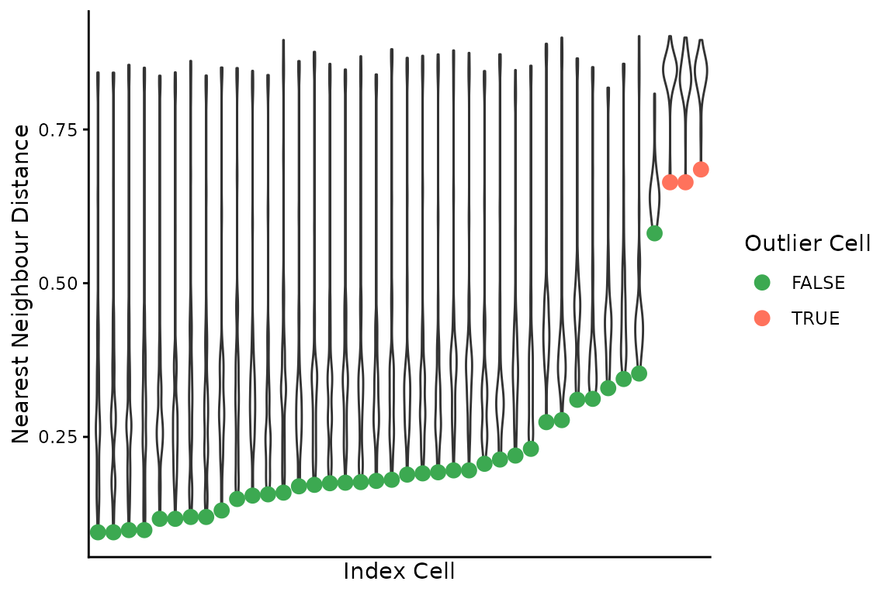

# Pairwise Differences Between Cells

``` r
library(dlptools)
```

The functions here were inspired by a paper called: *Genomic evolution
and cellular states of whole-genome doubling in ovarian cancer.* By
Weiner et al. 2025, some folks at MSKCC.

The basic idea is to count the numbers of bins that are different in
state between two cells, divided by the number of bins considered. Then
we can do things like fit a beta distribution to identify outliers, or
do other clustering to find groups of similar/different cells, etc.

These functions will make that a bit easier.

First some toy data:

``` r
reads_df <- vroom::vroom("data/example_reads.tsv.gz", show_col_types = FALSE)

# only using a few cells to demonstrate functions below
targ_cells <- unique(reads_df$cell_id)[1:40]

reads_df <- dplyr::filter(reads_df, cell_id %in% targ_cells)

# standard reads dataframe of bin based state calls
dplyr::slice_head(reads_df, n = 5)
#> # A tibble: 5 × 11
#>   cell_id                chr    start   end state     gc ideal   map reads valid
#>   <chr>                  <chr>  <dbl> <dbl> <dbl>  <dbl> <lgl> <dbl> <dbl> <lgl>
#> 1 AT23998-A138956A-R03-… 1     1   e0 5  e5     4 -1     FALSE 0.349    55 FALSE
#> 2 AT23998-A138956A-R03-… 1     5.00e5 1  e6     4 -1     FALSE 0.770   224 FALSE
#> 3 AT23998-A138956A-R03-… 1     1.00e6 1.5e6     4  0.598 FALSE 0.982   342 TRUE 
#> 4 AT23998-A138956A-R03-… 1     1.50e6 2  e6     4  0.539 TRUE  0.963   282 TRUE 
#> 5 AT23998-A138956A-R03-… 1     2.00e6 2.5e6     4  0.595 TRUE  0.997   385 TRUE 
#> # ℹ 1 more variable: is_low_mappability <lgl>
```

  
  

Now, we can measure pairwise distances between all cells. This involves:

1.  generating all pairwise cell comparisons
2.  aligning bins for each pair
3.  collapsing runs of bins based on *matched* and *unmatched* states
    between the cell pair – aka segmenting on state matches
4.  filtering small runs (segments) of matches or non-matches
5.  re-binning the runs
6.  counting number of non-matching bins, divided by total number of
    bins still considered
7.  presenting the results for each cell and it’s distances to all other
    cells

  

Warning, this function is *slow*, and the number of pairwise comparisons
grows with more cells. E.g., 100 cells is 4950 comparisons and takes a
couple minutes. There is definitely room for improvement here.

Parallelizing will make your life a bit better. Internally, this
function uses `furrr`, you just need to set up a plan.

``` r
# first set up a parallel plan, here with 4 cores being used
# future::plan(future::multisession, workers = 4)

pairwise_diffs <- dlptools::pairwise_bin_difference(
  reads_df,
  # min_seg_length = 2.5e6 # see function documentation. It's the minimum
  # length of a stretch of matching/unmatching bins to consider.
)

dplyr::slice_head(pairwise_diffs, n = 5)
#> # A tibble: 5 × 5
#>   n_diff tot_bins prop_diff index_cell               comp_cell               
#>    <int>    <int>     <dbl> <chr>                    <chr>                   
#> 1   2214     6144     0.360 AT23998-A138956A-R03-C34 AT23998-A138956A-R04-C58
#> 2   2286     6135     0.373 AT23998-A138956A-R03-C34 AT23998-A138956A-R05-C42
#> 3   2212     6151     0.360 AT23998-A138956A-R03-C34 AT23998-A138956A-R05-C64
#> 4   1972     6141     0.321 AT23998-A138956A-R03-C34 AT23998-A138956A-R06-C31
#> 5   2811     6151     0.457 AT23998-A138956A-R03-C34 AT23998-A138956A-R06-C34
```

which is each cell (`index cell`) compared to each other cell
(`comp_cell`) and some information on the proportion of bins different
(`prop_diff`).

  
  
  

We can then find the nearest neighbour of each cell:

``` r
(nn_cells <- dlptools::find_nearest_neighbours(pairwise_diffs))
#> # A tibble: 40 × 7
#>    n_diff tot_bins nn_diff index_cell comp_cell max_diff_to_all mean_diff_to_all
#>     <int>    <int>   <dbl> <chr>      <chr>               <dbl>            <dbl>
#>  1   1701     6134   0.277 AT23998-A… AT23998-…           0.899            0.422
#>  2   1107     6141   0.180 AT23998-A… AT23998-…           0.881            0.361
#>  3    801     6146   0.130 AT23998-A… AT23998-…           0.851            0.339
#>  4   1173     6151   0.191 AT23998-A… AT23998-…           0.870            0.357
#>  5   1202     6146   0.196 AT23998-A… AT23998-…           0.879            0.387
#>  6   1909     6151   0.310 AT23998-A… AT23998-…           0.866            0.467
#>  7    914     6134   0.149 AT23998-A… AT23998-…           0.850            0.349
#>  8   1313     6159   0.213 AT23998-A… AT23998-…           0.872            0.360
#>  9   1202     6146   0.196 AT23998-A… AT23998-…           0.875            0.388
#> 10   1352     6156   0.220 AT23998-A… AT23998-…           0.847            0.390
#> # ℹ 30 more rows
```

  
  
  

------------------------------------------------------------------------

**Side Note**

The function
[`dlptools::pairwise_bin_difference()`](https://molonc.github.io/dlptools/reference/pairwise_bin_difference.md)
has a `targ_cells` parameter. Leaving it empty, the default, compares
all cells in a pairwise manner.

This will compare the specified cell or cells against all others:

``` r
dlptools::pairwise_bin_difference(
  reads_df,
  targ_cells = unique(reads_df$cell_id)[1:2]
)
#> # A tibble: 77 × 5
#>    n_diff tot_bins prop_diff index_cell               comp_cell               
#>     <int>    <int>     <dbl> <chr>                    <chr>                   
#>  1   2214     6144     0.360 AT23998-A138956A-R03-C34 AT23998-A138956A-R04-C58
#>  2   2286     6135     0.373 AT23998-A138956A-R03-C34 AT23998-A138956A-R05-C42
#>  3   2212     6151     0.360 AT23998-A138956A-R03-C34 AT23998-A138956A-R05-C64
#>  4   1972     6141     0.321 AT23998-A138956A-R03-C34 AT23998-A138956A-R06-C31
#>  5   2811     6151     0.457 AT23998-A138956A-R03-C34 AT23998-A138956A-R06-C34
#>  6   2318     6134     0.378 AT23998-A138956A-R03-C34 AT23998-A138956A-R06-C54
#>  7   1701     6134     0.277 AT23998-A138956A-R03-C34 AT23998-A138956A-R07-C22
#>  8   1926     6146     0.313 AT23998-A138956A-R03-C34 AT23998-A138956A-R08-C36
#>  9   2607     6162     0.423 AT23998-A138956A-R03-C34 AT23998-A138956A-R08-C39
#> 10   2541     6153     0.413 AT23998-A138956A-R03-C34 AT23998-A138956A-R08-C41
#> # ℹ 67 more rows
```

  
  

Alternatively, if you want to just compare some set of cells against
themselves, best to just filter upfront:

``` r
reads_df |>
  dplyr::filter(cell_id %in% unique(reads_df$cell_id)[1:3]) |>
  dlptools::pairwise_bin_difference()
#> # A tibble: 3 × 5
#>   n_diff tot_bins prop_diff index_cell               comp_cell               
#>    <int>    <int>     <dbl> <chr>                    <chr>                   
#> 1   2214     6144     0.360 AT23998-A138956A-R03-C34 AT23998-A138956A-R04-C58
#> 2   2286     6135     0.373 AT23998-A138956A-R03-C34 AT23998-A138956A-R05-C42
#> 3   1754     6124     0.286 AT23998-A138956A-R04-C58 AT23998-A138956A-R05-C42
```

  

------------------------------------------------------------------------

  
  

We can then combine the pairwise differences and nearest neighbours to
find outlier cells by fitting a beta distribution to the latter, and
finding outlier pairwise comparisons:

``` r
(outlier_cells <- dlptools::find_outlier_cells(pairwise_diffs, nn_cells))
#> # A tibble: 3 × 7
#>   n_diff tot_bins nn_diff outlier_cell  nn_cell max_diff_to_all mean_diff_to_all
#>    <int>    <int>   <dbl> <chr>         <chr>             <dbl>            <dbl>
#> 1   4002     6026   0.664 AT23998-A138… AT2399…           0.902            0.839
#> 2   4002     6026   0.664 AT23998-A138… AT2399…           0.899            0.832
#> 3   4216     6155   0.685 AT23998-A138… AT2399…           0.896            0.836
```

  
  
  

There is a simple plot that can be made to visualize these distances:

``` r
dlptools::plot_nnd_outlier_cells(
  pairwise_diffs, nn_cells, outlier_cells
)
```



  
  
  

With a bit of work, we can re-orient the cell distances matrix to
contain each cell compared against all others. The original function
performs non-redundant comparisons: A-B, A-C, B-C.

For various reasons, we might also want to see C-A and C-B, even though
it’s redundant.

This is actually happening internally in several of the above functions.

This dataframe can get big, as it’s now every cell compared to every
other cell.

``` r
# first, we need to know all of the cells we want to do this for. It could
# be all cells, or some subset.

# the nearest neighbours frame is all input cells, so could use that.

cell_focused_df <- purrr::map_dfr(
  # might want to consider furrr::future_map_dfr
  unique(nn_cells$index_cell),
  \(cell) {
    dlptools::make_cell_focused_matrix(pairwise_diffs, cell)
  }
)

dplyr::slice_head(cell_focused_df, n = 5)
#> # A tibble: 5 × 5
#>   n_diff tot_bins prop_diff index_cell               comp_cell               
#>    <int>    <int>     <dbl> <chr>                    <chr>                   
#> 1   2214     6144     0.360 AT23998-A138956A-R03-C34 AT23998-A138956A-R04-C58
#> 2   2286     6135     0.373 AT23998-A138956A-R03-C34 AT23998-A138956A-R05-C42
#> 3   2212     6151     0.360 AT23998-A138956A-R03-C34 AT23998-A138956A-R05-C64
#> 4   1972     6141     0.321 AT23998-A138956A-R03-C34 AT23998-A138956A-R06-C31
#> 5   2811     6151     0.457 AT23998-A138956A-R03-C34 AT23998-A138956A-R06-C34
```

Now every cell will be present in the `index_cell` column.

  
  
  
