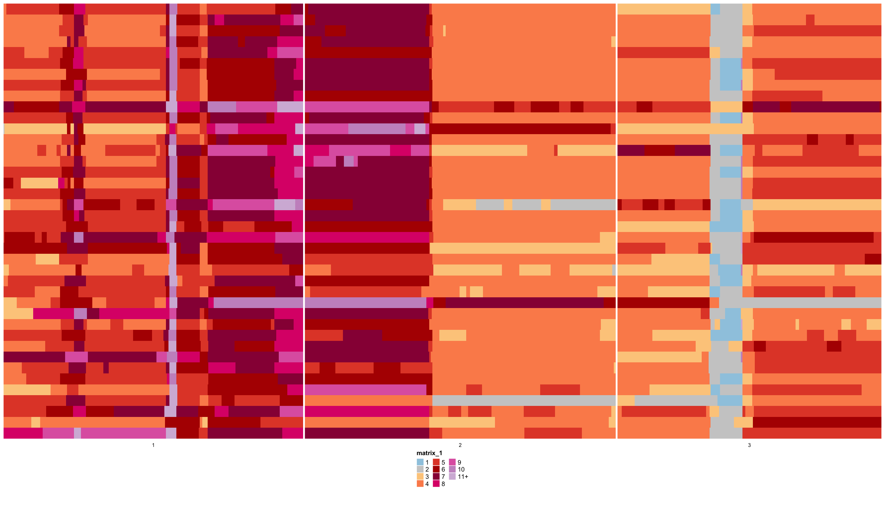
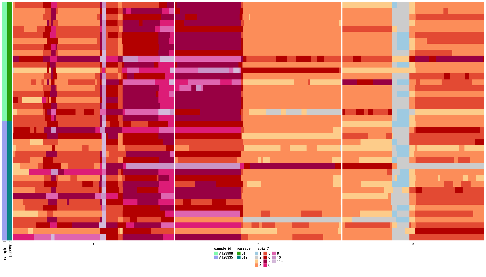

```{r, include = FALSE}
knitr::opts_chunk$set(
  collapse = TRUE,
  comment = "#>",
  message = FALSE,
  warning = FALSE
)
```

# dlptools

dlptools will help with basic file manipulation of DLP pipeline out and adding of genomic features to read bins for filtering and classification of changes. Also included are a few standard plots that are commonly made.

## Installation

You can install the development version of dlptools from [GitHub](https://github.com/) with:

``` r
# install.packages("devtools")
devtools::install_github("molonc/dlptools")
```

## Common Analysis Tasks

These are a few steps that are often taken to start a DLP analysis.

```{r example, message=FALSE, warning=FALSE, eval=FALSE}
library(fs)
library(dplyr)
library(dlptools)

# a file path to where some directories with DLP data lives. Expected structure
# discussed in README.md
dlp_dir <- "/projects/molonc/scratch/bfurman/dlp_testdata/"

# looks something like this
fs::dir_tree(dlp_dir, recurse = 1)
```


```
/projects/molonc/scratch/bfurman/dlp_testdata/
└── SC-8408
    ├── annotation
    └── hmmcopy
```


First step is usually to import the cell specific metrics and mark which cells are good ones to use for downstream analyses.

This example uses some typical thresholds, but you should think about these in relation to your project and sequence data at hand.


Importing data:

```{r, eval=FALSE}
metrics <- dlptools::import_dlp_files(dlp_dir, "metrics")
```

or really, however you like to load a directory of tsvs, this is just a convenience function as DLP output tends not to change run to run.


Here we can set some thresholds to define "good cells". These here are just a suggestion with some commonly used thresholds. These could be project specific.

```{r, eval=FALSE}
metrics <- metrics |>
  dplyr::mutate(
    good_cell = dplyr::if_else(
      quality >= 0.75 & # cells of high RF quality
        !is_control & # non-control cells
        cell_call == "C1" & # live cells
        !is_s_phase & # that are not estimated to be in S-phase
        total_mapped_reads >= 250000, # and have a reasonable amount of reads
      TRUE,
      FALSE
    )
  )
```


Loading the reads data would be the next step. These are 500 Kb bins where copy number estimates are converted into integer state calls by HMMCopy.

Similar to the metrics, we want to mark which bins are good to use for analyses with a few thresholds:

```{r, eval=FALSE}
reads <- dlptools::import_dlp_files(dlp_dir, "reads")
```


first, let's mark the ones that fall into regions we want to mask (see README.md for accessing this file).

```{r, eval=FALSE}
reads <- dlptools::mark_mask_regions(reads)
# defaults to inst/extdata/blacklist_2023.07.17.txt
```


```{r, eval=FALSE}
# you can load to inpect that file with
system.file("extdata", "blacklist_2023.07.17.txt", package = "dlptools") |>
  vroom::vroom()
```


then, we can add a column for which count as "good" bins. Again, just sugestions with commonly used thresholds:

```{r, eval=FALSE}
reads <- reads |>
  dplyr::mutate(
    good_bin = dplyr::if_else(
      !mask & # does not fall into mask region
        gc > -1 & # bin went through GC correciton
        map > 0.99, # read bin is in a high mappability region
      TRUE,
      FALSE
    )
  )
```

Now we can combine the reads state calls with the metrics, i.e., contextualizing the state calls with the cell level metrics:

```{r, eval=FALSE}
reads <- dplyr::left_join(
  reads, metrics,
  by = "cell_id",
)
```

and then create a filtered set of reads for analysis
```{r, eval=FALSE}
reads_filt <- dplyr::filter(reads, good_cell & good_bin)


# many columns of data available. Here is a subset
reads_filt[1:4, 2:10]
```


A common need is to have reads summarized into segments, which are collapsed blocks of read bins that have been assigned the same state. 

The DLP pipeline does produce a segments file, which you can import with:

 `dlptools::import_dlp_files(dlp_dir, "segs")`

but that file was made with internal filters and settings that you probably don't know or want.

So we can create one from our filtered reads:

```{r, eval=FALSE}
#  This can take a bit to run if you have a lot of runs combined.
segs_filt <- dlptools::reads_to_segs(reads_filt)

# this is now runs of adjacent read bins with identical states collapesed
# into a single bin. Of course, bins are no longer of equal size.
segs_filt[1:4, ]
```


## Plotting Trees and Heatmaps

A common plot from a DLP analysis is to build a tree with some method ([sitka](https://github.com/molonc/sitka_wrapper/tree/main), or hdbscan, medicc, dice, etc.) and then plot it next to a heatmap of read state calls. 

The package [Signals](https://github.com/shahcompbio/signals/tree/master) has great functions to do this (and lots of other useful functions for this kind of stuff). 


Alternatively, in this package there is `dlptools::plot_state_hm()`. The method here heavily mimics what Signals does, with some more conviences. The methods in Signals have many other functions for dealing with things not covered here (like scaling branch lengths, etc.).

`dlptools::plot_state_hm()` is meant to be a one stop shop for heatmap plotting.

We'll work from some example data (a trimmed output of signals, but just DLP reads output works fine too):

```{r}
ex_state_dat <- vroom::vroom("data/ex_state_dat.tsv.gz")

head(ex_state_dat)
```

```
# A tibble: 6 × 10
  cell_id sample_id passage   chr  start    end state   BAF state_AS state_phase
  <chr>   <chr>     <chr>   <dbl>  <dbl>  <dbl> <dbl> <dbl> <chr>    <chr>      
1 AT2399… AT23998   p1          1 2.00e6 2.5 e6     4 0.179 3|1      A-Gained   
2 AT2399… AT23998   p1          1 3.00e6 3.5 e6     4 0.294 3|1      A-Gained   
3 AT2399… AT23998   p1          1 4.00e6 4.50e6     4 0.211 3|1      A-Gained   
4 AT2399… AT23998   p1          1 4.50e6 5   e6     5 0.299 5        A-Gained   
5 AT2399… AT23998   p1          1 5.00e6 5.50e6     5 0.182 5        A-Gained   
6 AT2399… AT23998   p1          1 5.50e6 6   e6     5 0.129 5        A-Gained
```


1. basic heatmap:

```{r, eval=FALSE}
dlptools::plot_state_hm(
  states_df = ex_state_dat,
  state_col = "state",
  # optional, but recommended dump direct to a file with:
  file_name = "imgs/basic_hm.png"
  # recommended for full, large, heatmaps
)
```

```{r, out.width="75%", out.height="75%"}

```


Or with a different column:

```{r, eval=FALSE}
dlptools::plot_state_hm(
  states_df = ex_state_dat,
  state_col = "state_phase",
  # optional, but recommended dump direct to a file with:
  file_name = "imgs/basic_phase_hm.png"
  # recommended for full, large, heatmaps
)
```


```{r, out.width="75%", out.height="75%"}
knitr::include_graphics("imgs/basic_phase_hm.png")
```


2. add a tree:

```{r, eval=FALSE}
ex_tree <- ape::read.tree("data/pkg_tree.newick")

dlptools::plot_state_hm(
  states_df = ex_state_dat,
  state_col = "state",
  phylogeny = ex_tree,
  file_name = "imgs/with_tree_hm.png"
)
```


```{r, out.width="75%", out.height="75%"}
knitr::include_graphics("imgs/with_tree_hm.png")
```


3. annotation data.

This can come from a separate data frame with annotations per cell ID, or you can point to columns in your state dataframe:

```{r, eval=FALSE}
dlptools::plot_state_hm(
  states_df = dplyr::mutate(ex_state_dat, passage = as.factor(passage)),
  state_col = "state",
  file_name = "imgs/annotations_hm.png",
  anno_columns = c("sample_id", "passage"),
  # you could control the colors of your annotations with:
  # anno_colors_list = list(passage=c(`1`='#2872bc', `19`='#d23e3e')),
)
```


```{r, out.width="75%", out.height="75%"}
knitr::include_graphics("imgs/annotations_hm.png")
```


Or with some pre-made annotation dataframe created by cell id:

```{r, eval=FALSE}
anno_df <- dplyr::distinct(ex_state_dat, cell_id, sample_id, passage)


dlptools::plot_state_hm(
  states_df = ex_state_dat,
  state_col = "state",
  anno_df = anno_df,
  file_name = "imgs/annotations_2_hm.png"
)
```


```{r, out.width="75%", out.height="75%"}

```

And with either of these, we can add a tree with the `phylogeny` arguments.


4. clones

Clones work similar to annotations, where you can either supply a data frame with `cell_id` and `clone_id` columns, or just pull the information from the states dataframe:

```{r, eval=FALSE}
# fake some clone data
ex_state_dat <- ex_state_dat |>
  dplyr::mutate(
    clone = dplyr::if_else(passage == "p1", "A", "B"),
  )


dlptools::plot_state_hm(
  states_df = ex_state_dat,
  state_col = "state_phase",
  file_name = "imgs/with_clones.png",
  clone_column = "clone",
  # optional, don't have to have annotations, or could pass the dataframe like
  # above
  anno_columns = c("sample_id", "passage"),
  # optional, don't have to have tree
  phylogeny = ex_tree,
  # optional, turns on tree coloring by clone
  color_tree_clones = TRUE,
  # optional, only largest cell group of a clone gets a letter label.
  only_largest_clone_group = TRUE
)
```


```{r, out.width="75%", out.height="75%"}
knitr::include_graphics("imgs/with_clones.png")
```


## Errors

If you see an error like this:

```
Error in `fortify()`:
! `data` must be a <data.frame>, or an object coercible by `fortify()`, or a valid <data.frame>-like object coercible by `as.data.frame()`.
Caused by error in `.prevalidate_data_frame_like_object()`:
! `dim(data)` must return an <integer> of length 2.
```

That's a complaint from ggtree that I need to fix and haven't yet.

Loading ggtree should fix it:

```{r, eval=FALSE}
library(ggtree)
```
