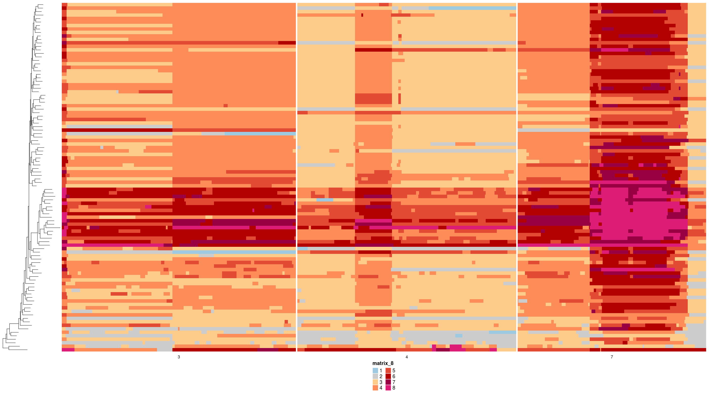
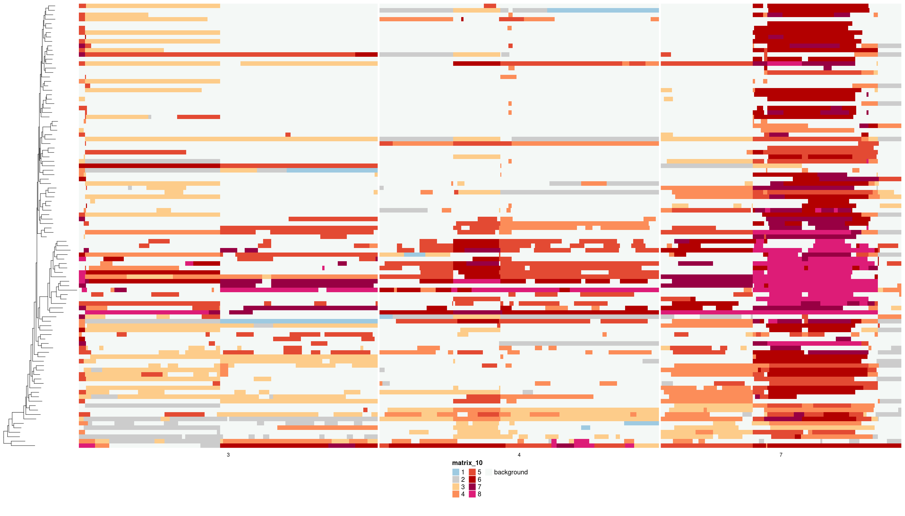
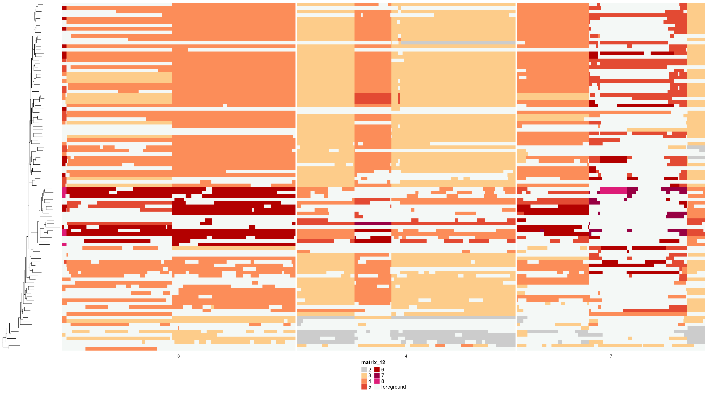
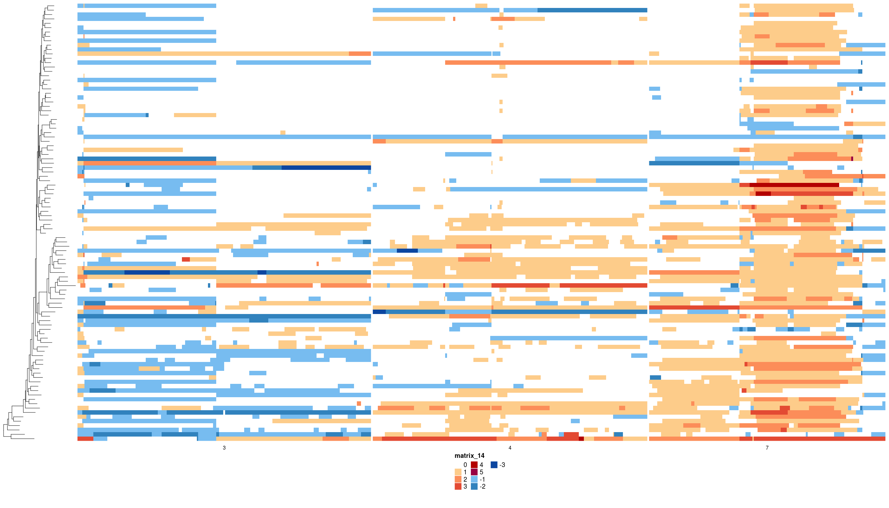

```{r, include = FALSE}
knitr::opts_chunk$set(
  collapse = TRUE,
  comment = "#>"
)
```

```{r setup}
library(dlptools)
```


"Foreground" *in the world of DLP+, in our lab*, and **at the current moment**, is the concept of labelling copy number alterations that are specific to a given cell. 

These are events that are happening in single cells during division generating variation among cells in a sequenced sample. The idea is that this is the variation that selection ultimately functions on to fix changes in tumours, driving tumour evolution.

How exactly to go about doing this is still a work in progress. The code available here is under development and will change. Included are some functions and plotting capabilities to make current efforts easier to apply across DLP libraries.


## General Helpers

Retrieve node labels of immediate parents to tree tips:

```{r}
ex_tree <- ape::read.tree("data/pkg_tree.newick")

tip_parents <- dlptools::get_tip_parents(ex_tree)

dplyr::slice_head(tip_parents, n = 10)
```

the result is a dataframe with the tip and it's immediate parent node in a tree.

<br>
<br>

Typically, we'd also have dataframe of states for bins in cells, and this simple wrapper exists that will add this parent node information to the dataframe:

```{r}
states <- vroom::vroom("data/ex_state_dat.tsv.gz", show_col_types = FALSE)

states_w_node_info <- dlptools::add_tip_ancestors_to_df(states, ex_tree)

states_w_node_info |>
  dplyr::select(cell_id, chr, start, end, state, parent_node) |>
  dplyr::slice_head(n = 10)
```


## Medicc

At the moment, one method being explored for "foreground" labelling is with Medicc. Medicc, which we use to build phylogenetic trees, as part of it's methods builds CN profiles of the internal nodes of a tree that reflect the input data.

So, if you input a set of bins with CN estimates for cells, it will output the CN calls for that set of bins for each internal tree node. Assessing the changes in those CN states between tips and parents is one method to look at foreground changes.

There are a ton of caveats to this and limits to the model, best discussed elsewhere.


Here, we'll using some example data, which is a reduced set of data from a full library. First loading the data:

```{r}
# we can ingest the medicc tree. This is a simple wrapper to drop the diploid
# branch, which medicc invents and includes
med_tree <- dlptools::read_medicc_tree("data/ex_med_fg_tree.nwk")

# and we can import the profiles file output by medicc
# this function does some simple changes to the file to make things easier
med_profiles <- dlptools::read_medicc_profiles("data/ex_profiles.tsv.gz")
```

<br>

and now we can infer the changes between tips and immediate parents:

```{r}
states_df <- dlptools::medicc_profiles_to_foreground(
  med_profiles, med_tree,
  cn_type = "total"
)
```


The result is a dataframe of the state data given to medicc for the tips, and added columns of the states of the immediate parent node of those tips.

```{r}
states_df |>
  dplyr::select(
    cell_id, chr, start, end, state, parent_state, parent_node,
    fg_change, fg_type, foreground, background
  ) |>
  dplyr::slice_sample(n = 10)
```


## Plotting Foreground

We can visualize these inference in our classic heatmaps, highlighting differnt features.

First, as a reference point the raw states:

```{r}
# subsetting chromosomes for plotting purposes
states_sub <- dplyr::filter(states_df, chr %in% c(3, 4, 7))
```


```{r, eval=FALSE}
dlptools::plot_state_hm(
  states_sub,
  state_col = "state",
  phylogeny = med_tree,
  file_name = "imgs/ex_med_raw_states.png"
)
```


```{r, out.width="75%", out.height="75%", echo=FALSE}

```


The raw states of the inferred foreground events:

```{r, eval=FALSE}
dlptools::plot_fg_state_highlight(
  states_df = states_sub,
  phylogeny = med_tree,
  file_name = "imgs/medicc_fg_highlight.png"
)
```


```{r, out.width="75%", out.height="75%", echo=FALSE}

```


The raw states of the implied background:

```{r, eval=FALSE}
dlptools::plot_bg_state_highlight(
  states_df = states_sub,
  phylogeny = med_tree,
  file_name = "imgs/medicc_bg_highlight.png"
)
```


```{r, out.width="75%", out.height="75%", echo=FALSE}

```


And the states of foreground events themselves, i.e., the change from the parent node to tip:

```{r, eval=FALSE}
dlptools::plot_heatmap_of_tip_changes(
  states_df = states_sub,
  phylogeny = med_tree,
  file_name = "imgs/medicc_fg_change.png"
  # can specify the name of the column, if you didn't use the above functions
  # to generate. Basically any column that is an integer spanning - to + changes.
  # changes_col = "fg_change"
)
```

Currently there is a limit to +/- 8 state changes between parent node and tip, simply because I couldn't find more colors that seemed to work well in the palette. So anything bigger than that is capped at +/- 8. Jumps beyond this are likely rare.


```{r, out.width="75%", out.height="75%", echo=FALSE}

```

<br>
<br>
<br>
<br>


```{r, eval=FALSE, echo=FALSE}
# generating the example data for this vignette

p9_tree_file <- "/projects/molonc/scratch/bfurman/projects/osteosarcoma/foreground_playing/OS052_p9_all_chroms_medicc_events/OS052_p9_justgoodbins_allChroms_medicc_in_final_tree.new"

os052_p9_tree <- ape::read.tree(p9_tree_file) |> ape::drop.tip("diploid")


med_out_dir <- "/projects/molonc/scratch/bfurman/projects/osteosarcoma/foreground_playing/OS052_p9_all_chroms_medicc_events/"

profiles_f <- "OS052_p9_justgoodbins_allChroms_medicc_in_final_cn_profiles.tsv"

meddic_profiles_file <- fs::path_join(c(med_out_dir, profiles_f))

profs <- vroom::vroom(meddic_profiles_file)

targ_ids <- sample(
  grep("internal|diploid", unique(profs$sample_id), invert = TRUE, value = TRUE),
  size = 100
)

profs_filt <- profs |>
  dplyr::filter(
    sample_id %in% targ_ids | stringr::str_detect(sample_id, "internal")
  )


os052_p9_tree_filt <- ape::drop.tip(
  os052_p9_tree,
  os052_p9_tree$tip.label[!os052_p9_tree$tip.label %in% c(targ_ids, "diploid")]
)

vroom::vroom_write(profs_filt, "data/ex_profiles.tsv.gz")
ape::write.tree(os052_p9_tree_filt, "data/ex_med_fg_tree.nwk")
```
