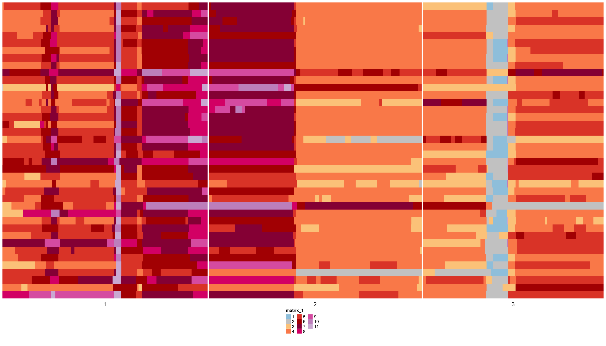
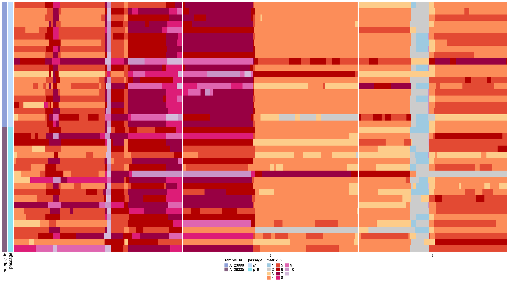
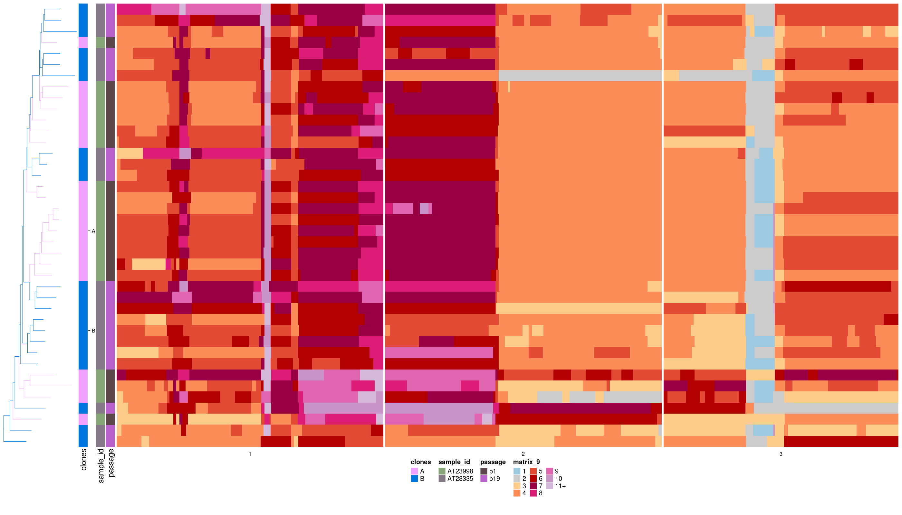

```{r, include = FALSE}
knitr::opts_chunk$set(
  collapse = TRUE,
  comment = "#>",
  message = FALSE,
  warning = FALSE
)
```


```{r libraries, echo=FALSE}
library(dlptools)
```


# Plotting Trees and Heatmaps

DLP data is commonly vizualized as a heatmap of copy number states across the genome. 

Next to this heatmap, we often want to add:

1. phylogenetic trees of the cellular relationships
2. annotations of sample, experiments
3. clonal identities both as labels and colors on the tree


The package [Signals](https://github.com/shahcompbio/signals/tree/master) has great functions to do this (and lots of other useful functions for DLP and single cell analyses). 


Alternatively, in this package there is `dlptools::plot_state_hm()`, which does similar things to the Signals package, but with some more conveniences.

`dlptools::plot_state_hm()` is meant to be a one stop shop for heatmap plotting of many variable types and options (click that link for all of the options).


The main constraint is to have a column called `cell_id` that contains the cell labels. 


We'll work from some example data to show some examples (it's a trimmed output of signals, but just DLP reads output works fine too):

```{r}
ex_state_dat <- vroom::vroom("data/ex_state_dat.tsv.gz")

head(ex_state_dat)
```


## basic heatmap

```{r, eval=FALSE}
dlptools::plot_state_hm(
  states_df = ex_state_dat,
  state_col = "state",
  # optional, but recommended dump direct to a file with:
  file_name = "imgs/basic_hm.png"
  # recommended for full, large, heatmaps
  # optional for HMMcopy state data, 11 is really 11+, so we can display the
  # legend that way with
  # legend_11plus=TRUE
)
```

```{r, out.width="75%", out.height="75%", echo=FALSE}

```


Or with a different column:

```{r, eval=FALSE}
dlptools::plot_state_hm(
  states_df = ex_state_dat,
  state_col = "state_phase",
  # optional, but recommended dump direct to a file with:
  file_name = "imgs/basic_phase_hm.png"
  # recommended for full, large, heatmaps
)
```


```{r, out.width="75%", out.height="75%", echo=FALSE}
knitr::include_graphics("imgs/basic_phase_hm.png")
```


Column options include:

1. state
2. state_phase (A-gained, B-hom, etc)
3. A
4. B
5. BAF
6. state_AS
7. state_AS_phased (might be too many states to usefully visualize)
8. or pretty much any custom column you want to plot that is reasonably similar.


---


## Adding a Tree

```{r, eval=FALSE}
ex_tree <- ape::read.tree("data/pkg_tree.newick")

dlptools::plot_state_hm(
  states_df = ex_state_dat,
  state_col = "state",
  phylogeny = ex_tree,
  file_name = "imgs/with_tree_hm.png"
)
```


```{r, out.width="75%", out.height="75%", echo=FALSE}
knitr::include_graphics("imgs/with_tree_hm.png")
```


## Adding Annotation Data

This can come from a separate data frame with annotations per cell ID, or you can point to columns in your state dataframe:

```{r, eval=FALSE}
dlptools::plot_state_hm(
  states_df = dplyr::mutate(ex_state_dat, passage = as.factor(passage)),
  state_col = "state",
  file_name = "imgs/annotations_hm.png",
  anno_columns = c("sample_id", "passage"),
  # you could control the colors of your annotations with:
  # anno_colors_list = list(passage=c(`1`='#2872bc', `19`='#d23e3e')),
)
```


```{r, out.width="75%", out.height="75%", echo=FALSE}

```


Or with some pre-made annotation dataframe created by cell id:

```{r, eval=FALSE}
anno_df <- dplyr::distinct(ex_state_dat, cell_id, sample_id, passage)


dlptools::plot_state_hm(
  states_df = ex_state_dat,
  state_col = "state",
  anno_df = anno_df,
  file_name = "imgs/annotations_2_hm.png"
)
```


```{r, out.width="75%", out.height="75%", echo=FALSE}
knitr::include_graphics("imgs/annotations_2_hm.png")
```

And with either of these, we can add a tree with the `phylogeny` arguments.


## Annotation and Legends

We can also control aspects of the legend and plot title with some options:

```{r}
dlptools::plot_state_hm(
  states_df = dplyr::mutate(ex_state_dat, passage = as.factor(passage)),
  state_col = "state",
  anno_columns = c("sample_id", "passage"),
  # file_name = "your_heatmap.png" ## still good idea to drop direct to file
  # you could control the colors of your annotations with:
  anno_colors_list = list(passage = c(p1 = "#2872bc", p19 = "#d23e3e")),
  # can turn off the legend for the heatmap values
  show_heatmap_legend = FALSE,
  # can show, or not, the annotation legend
  show_annotation_legend = TRUE,
  # can set a title
  hm_title = "A heatmap showing important Science!",
  # and aspects of the display sizes for titles and labels
  annotation_legend_param = list(
    title_gp = grid::gpar(fontsize = 20, fontface = "bold"),
    labels_gp = grid::gpar(fontsize = 16),
    gp = grid::gpar(fontsize = 5)
  )
)
```


<br>
<br>

We can also build a fully custom legend...but takes some work, and you'd probably want a pretty good understanding of `ComplexHeatmap::packLegend`:

```{r}
dlptools::plot_state_hm(
  states_df = dplyr::mutate(ex_state_dat, passage = as.factor(passage)),
  state_col = "state",
  anno_columns = c("sample_id", "passage"),
  # file_name = "your_heatmap.png" ## still good idea to drop direct to file
  # turn off default legends
  show_heatmap_legend = FALSE,
  show_annotation_legend = FALSE,
  anno_colors_list = list(passage = c(p1 = "#2872bc", p19 = "#d23e3e")),
  # and aspects of the display sizes for titles and labels
  custom_legend = ComplexHeatmap::packLegend(
    ComplexHeatmap::Legend(
      title = "pAsSaGe",
      labels = unique(ex_state_dat$passage),
      # would need to match colours above
      legend_gp = grid::gpar(fill = c(p1 = "#2872bc", p19 = "#d23e3e")),
      labels_gp = grid::gpar(fontsize = 14, fontface = "bold"),
      title_gp = grid::gpar(fontsize = 16, fontface = "bold")
    )
  )
)
```

<br>
<br>

## Clone Information

Clones work similar to annotations, where you can either supply a data frame with `cell_id` and `clone_id` columns, or just pull the information from the states dataframe:

```{r, eval=FALSE}
# fake some clone data
ex_state_dat <- ex_state_dat |>
  dplyr::mutate(
    clone = dplyr::if_else(passage == "p1", "A", "B"),
  )


dlptools::plot_state_hm(
  states_df = ex_state_dat,
  state_col = "state_phase",
  file_name = "imgs/with_clones.png",
  clone_column = "clone",
  # optional, don't have to have annotations, or could pass the dataframe like
  # above
  anno_columns = c("sample_id", "passage"),
  # optional, don't have to have tree
  phylogeny = ex_tree,
  # optional, turns on tree coloring by clone
  color_tree_clones = TRUE,
  # optional, only largest cell group of a clone gets a letter label.
  only_largest_clone_group = TRUE
)
```


```{r, out.width="75%", out.height="75%", echo=FALSE}

```


## Continous Variables

```{r, eval=FALSE}
dlptools::plot_state_hm(
  states_df = ex_state_dat,
  state_col = "copy",
  continuous_hm_colours = TRUE,
  # optional, can specify the colors
  # custom_continuous_colors = c("#000000", "#ffffff", "#5F9EA0")
  # optional, can specify values to fill out low, mid, high end of range
  # basically has the effect of squishing or stretching the color scale
  # custom_continuous_range = c(0, 2, 10)
  file_name = "imgs/continuous.png"
)

# and all of this can be specified with annotations, trees, etc.
# as above.
```


```{r, out.width="75%", out.height="75%", echo=FALSE}
knitr::include_graphics("imgs/continuous.png")
```
