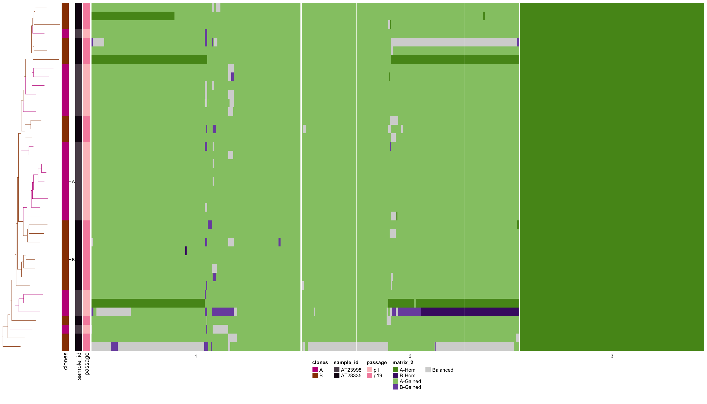

```{r, include = FALSE}
knitr::opts_chunk$set(
  collapse = TRUE,
  comment = "#>",
  message = FALSE,
  warning = FALSE
)
```


```{r libraries, echo=FALSE}
library(dlptools)
library(vroom)
library(dplyr)
```


# Plotting Trees and Heatmaps

DLP data is commonly vizualized as a heatmap of copy number states across the genome. 

Next to this heatmap, we often want to add:

1. phylogenetic trees of the cellular relationships
2. annotations of sample, experiments
3. clonal identities both as labels and colors on the tree


The package [Signals](https://github.com/shahcompbio/signals/tree/master) has great functions to do this (and lots of other useful functions for DLP and single cell analyses). 


Alternatively, in this package there is `dlptools::plot_state_hm()`, which does similar things to the Signals package, but with some more conveniences.

`dlptools::plot_state_hm()` is meant to be a one stop shop for heatmap plotting of many variable types and options.


`?dlptools::plot_state_hm()` will show the options, and below we'll walk throuh some examples.

The main constraint is to have a column called `cell_id` that contains the cell labels. 

```{r, eval=FALSE}
plot_state_hm(
  # long format bin level data
  states_df,
  # column of data to plot
  state_col,
  # optional, tree with tip labels matching the cell_id column
  phylogeny = NULL,
  # for direct saving to a file
  file_name = NULL,
  # optional dataframe of a cell_id column + any cell level information columns
  anno_df = NULL,
  # for custom colors of annotations, see ?plot_state for examples
  anno_colors_list = list(),
  # can call out the annotation columns from the original dataframe
  # instead of a separate frame.
  anno_columns = NULL,
  # optional, can also specify columns in the dataframe
  clones_df = NULL,
  # column name to pull clone IDs from instead of separate DF.
  clone_column = NULL,
  # bool, color the tree with clone colors
  color_tree_clones = FALSE,
  # bool, only letter label the largest group of any given clone
  only_largest_clone_group = FALSE,
  # font size of labels on heatmap image
  labels_fontsize = 8,
  # set to TRUE if plotting continuous values on the heatmap.
  continuous_hm_colours = FALSE,
  # specificiation of color range for continuous values
  custom_continuous_colors = NULL,
  # specification of values for ends of continous range.
  custom_continuous_range = NULL
)
```


We'll work from some example data (a trimmed output of signals, but just DLP reads output works fine too):

```{r}
ex_state_dat <- vroom::vroom("data/ex_state_dat.tsv.gz")

head(ex_state_dat)
```


1. basic heatmap:

```{r, eval=FALSE}
dlptools::plot_state_hm(
  states_df = ex_state_dat,
  state_col = "state",
  # optional, but recommended dump direct to a file with:
  file_name = "imgs/basic_hm.png"
  # recommended for full, large, heatmaps
)
```

```{r, out.width="75%", out.height="75%", echo=FALSE}
knitr::include_graphics("imgs/basic_hm.png")
```


Or with a different column:

```{r, eval=FALSE}
dlptools::plot_state_hm(
  states_df = ex_state_dat,
  state_col = "state_phase",
  # optional, but recommended dump direct to a file with:
  file_name = "imgs/basic_phase_hm.png"
  # recommended for full, large, heatmaps
)
```


```{r, out.width="75%", out.height="75%", echo=FALSE}

```


Column options include:

1. state
2. state_phase (A-gained, B-hom, etc)
3. A
4. B
5. BAF
6. state_AS
7. state_AS_phased (might be too many states to usefully visualize)
8. or pretty much any custom column you want to plot that is reasonably similar.


---


2. add a tree:

```{r, eval=FALSE}
ex_tree <- ape::read.tree("data/pkg_tree.newick")

dlptools::plot_state_hm(
  states_df = ex_state_dat,
  state_col = "state",
  phylogeny = ex_tree,
  file_name = "imgs/with_tree_hm.png"
)
```


```{r, out.width="75%", out.height="75%", echo=FALSE}

```


3. annotation data.

This can come from a separate data frame with annotations per cell ID, or you can point to columns in your state dataframe:

```{r, eval=FALSE}
dlptools::plot_state_hm(
  states_df = dplyr::mutate(ex_state_dat, passage = as.factor(passage)),
  state_col = "state",
  file_name = "imgs/annotations_hm.png",
  anno_columns = c("sample_id", "passage"),
  # you could control the colors of your annotations with:
  # anno_colors_list = list(passage=c(`1`='#2872bc', `19`='#d23e3e')),
)
```


```{r, out.width="75%", out.height="75%", echo=FALSE}

```


Or with some pre-made annotation dataframe created by cell id:

```{r, eval=FALSE}
anno_df <- dplyr::distinct(ex_state_dat, cell_id, sample_id, passage)


dlptools::plot_state_hm(
  states_df = ex_state_dat,
  state_col = "state",
  anno_df = anno_df,
  file_name = "imgs/annotations_2_hm.png"
)
```


```{r, out.width="75%", out.height="75%", echo=FALSE}
knitr::include_graphics("imgs/annotations_2_hm.png")
```

And with either of these, we can add a tree with the `phylogeny` arguments.


4. clones

Clones work similar to annotations, where you can either supply a data frame with `cell_id` and `clone_id` columns, or just pull the information from the states dataframe:

```{r, eval=FALSE}
# fake some clone data
ex_state_dat <- ex_state_dat |>
  dplyr::mutate(
    clone = dplyr::if_else(passage == "p1", "A", "B"),
  )


dlptools::plot_state_hm(
  states_df = ex_state_dat,
  state_col = "state_phase",
  file_name = "imgs/with_clones.png",
  clone_column = "clone",
  # optional, don't have to have annotations, or could pass the dataframe like
  # above
  anno_columns = c("sample_id", "passage"),
  # optional, don't have to have tree
  phylogeny = ex_tree,
  # optional, turns on tree coloring by clone
  color_tree_clones = TRUE,
  # optional, only largest cell group of a clone gets a letter label.
  only_largest_clone_group = TRUE
)
```


```{r, out.width="75%", out.height="75%", echo=FALSE}

```


5. Other continous variables

```{r, eval=FALSE}
dlptools::plot_state_hm(
  states_df = ex_state_dat,
  state_col = "copy",
  continuous_hm_colours = TRUE,
  # optional, can specify the colors
  # custom_continuous_colors = c("#000000", "#ffffff", "#5F9EA0")
  # optional, can specify values to fill out low, mid, high end of range
  # basically has the effect of squishing or stretching the color scale
  # custom_continuous_range = c(0, 2, 10)
  file_name = "imgs/continuous.png"
)

# and all of this can be specified with annotations, trees, etc.
# as above.
```


```{r, out.width="75%", out.height="75%", echo=FALSE}

```

## Errors

If you see an error like this:

```
Error in `fortify()`:
! `data` must be a <data.frame>, or an object coercible by `fortify()`, or a valid <data.frame>-like object coercible by `as.data.frame()`.
Caused by error in `.prevalidate_data_frame_like_object()`:
! `dim(data)` must return an <integer> of length 2.
```

That's a complaint from ggtree that I need to fix and haven't yet.

Loading ggtree should fix it:

```{r, eval=FALSE}
library(ggtree)
```
