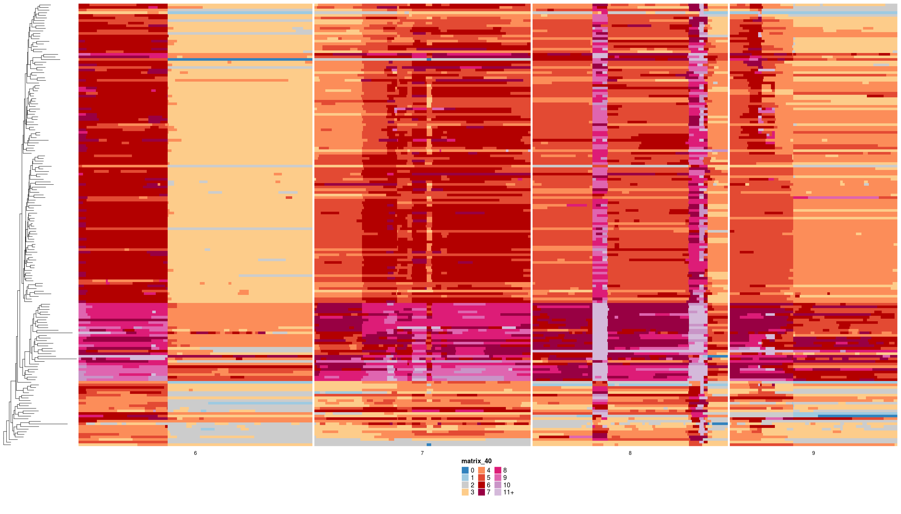

```{r, include = FALSE}
knitr::opts_chunk$set(
  collapse = TRUE,
  comment = "#>"
)
```


```{r setup, message=FALSE, warning=FALSE, echo=FALSE, error=FALSE}
library(ape)
library(dplyr)
library(tibble)
library(phangorn)
library(ggtree)
library(dlptools)

set.seed(666)
```


With DLP data, we often need to build a tree to sort out relationships among the cells. There exists multiple methods to building trees [medicc](https://bitbucket.org/schwarzlab/medicc2/src/master/), [dice](https://github.com/samsonweiner/DICE/tree/main?tab=readme-ov-file), [sitka](https://github.com/UBC-Stat-ML/sitkatree), each with their own suite of parameters. As well, there are multiple approachs to prep the data for tree building (filtering, etc).

<br>

In the absence of simulations that match the complexity of whatever data we have on hand, how do we know when one confluence of settings is "better" than the other?

Often we look at heatmaps with trees and just sort of "check the vibe". 


<br>
<br>

For example:

```{r, echo=FALSE, out.width="60%", out.height="50%", fig.show='hold', fig.align='center'}
knitr::include_graphics(c("imgs/real_tree.png", "imgs/rand_tree.png"))
```
<br>

were we probably trust the top result more than the bottom results.

<br>

But what is this "**vibe**" that we are checking? 

<br>

Generally, when a tree building algorithm is doing well, it should group more similar taxa closer together in the tree. When we look at heatmaps of copy number, that's probably what we are cueing on visually, is an overall high level of grouping for cells that have similar states across the genome.


We can capture this sentiment by evalutating the degree of state similarity between sibling taxa.


## The Metric

The idea employed here is simple, when comparing trees, the "better" one will have sister taxa that are more similar to one another.

We can evaluate this in a non-perfect way by evaluting string distance between states across the genome of sibling tree tips. (See the section **Future Thoughts** below for why this isn't a perfect method.)

<br>

Starting with some toy data:

```{r, warning=FALSE, message=FALSE, fig.width=5}
# starting with a simple tree
toy_tree <- ape::read.tree(text = "(A, (B, C));")

# and 3 bins of state data for each tip
toy_states <- tibble::tibble(
  cell_id = rep(c("A", "B", "C"), each = 3),
  start = rep(c(1, 10, 20), 3),
  end = rep(c(9, 19, 29), 3),
  state = c(4, 4, 4, 4, 8, 8, 4, 8, 2),
  chr = 1
)

# making a matrix for the plot
toy_w <- dlptools::convert_long_reads_to_wide(toy_states)
toy_mat <- dplyr::select(toy_w, -cell_id) |> as.matrix()
rownames(toy_mat) <- toy_w$cell_id
class(toy_mat) <- "character"

toy_p <- ggtree::ggtree(toy_tree) +
  ggtree::geom_tiplab() +
  ggtree::geom_nodelab(aes(label = node), hjust = -2, color = "red") +
  ggtree::geom_tiplab(aes(label = node), hjust = -2, color = "red")

ggtree::gheatmap(toy_p, toy_mat, colnames = FALSE) +
  theme(legend.position = "none") +
  scale_fill_manual(values = dlptools::CNV_COLOURS)
```

3 tips with 3 bins of state data. Node/tip numbers highlighted in red.

<br>
<br>
<br>
<br>

These bin states can be represented as a string of states for each cell:

```{r}
toy_state_strings <- dlptools::cell_states_to_strings(toy_states)
toy_state_strings
```

*note*: the states are converted to letters so that double digit states don't count as 2 characters.

i.e.,
```{r}
dlptools::map_states_to_letters(0:11)
```


<br>
<br>

We can compute the sibling nodes for each of the tips:


```{r}
phangorn::Siblings(toy_tree, node = toy_tree$tip.label)
```

The output is a bit confusing, but basically the element of the list `[[2]]` (aka, tip `B`) represents the node of the tip, and the entry `3` represents its sibling node (aka, tip `C`).


<br>
<br>

So in this tree, taxa B and C are sister taxa, and we can compute their distance from each other:

```{r}
# for demonstration, doing "by hand"...will show more automated methods below
b_string <- toy_state_strings[toy_state_strings$tip_label == "B", ]$states_string
c_string <- toy_state_strings[toy_state_strings$tip_label == "C", ]$states_string

b_c_dist <- stringdist::stringdist(b_string, c_string)

b_c_dist
```

distance of 1 because there is 1 bin with a diffrence.

<br>
<br>

For A, it's a bit more tricky because the whole clade containing B and C (i.e., node `5`) are the sister taxa.


```{r, echo=FALSE}
ggtree::ggtree(toy_tree) +
  ggtree::geom_tiplab() +
  ggtree::geom_nodelab(aes(label = node), hjust = -2, color = "red") +
  ggtree::geom_tiplab(aes(label = node), hjust = -2, color = "red") +
  ggtree::geom_strip("B", "C", offset = 0.1, color = "red", geom = "line", linetype = 2) +
  ggtree::geom_taxalink(taxa1 = "A", taxa2 = 5, linetype = 2, color = "red")
```


The approach taken here is to calculate the distance to each and take the mean:

```{r}
a_string <- toy_state_strings[toy_state_strings$tip_label == "A", ]$states_string

a_to_bc_dists <- stringdist::stringdist(a_string, c(b_string, c_string))

a_to_bc_dists
```

And then for the whole tree, we can just take the mean of all the sibling distances:

```{r}
mean(c(b_c_dist, mean(a_to_bc_dists)))
```


<br>
<br>

Of course, that is too much work, so we can just call the function:

```{r}
dlptools::compute_tip_sibling_distances(
  states_df = toy_states, # the long format state data
  tree = toy_tree,
)
```

## Real(-ish) Data Example

This computed value doesn't mean anything on it's own -- it's just a number. It's meant as a comparison tool to other trees.

Returning to the trees at the start of this vignette, we can assess how well each did:

```{r}
# loading the data and tree underlying those plots at the top
ex_tree <- ape::read.tree("data/tree_support.nwk")
dlp_states <- vroom::vroom("data/tree_support_states.tsv.gz", show_col_types = FALSE)


# generate a random tree as the "bad tree"
rand_tree <- ape::rtree(length(ex_tree$tip.label))
rand_tree$tip.label <- sample(ex_tree$tip.label, size = length(ex_tree$tip.label))
```


The real tree:

```{r, echo=FALSE, out.width="60%", out.height="50%", fig.align='center'}

```


```{r}
dlptools::compute_tip_sibling_distances(
  states_df = dlp_states,
  tree = ex_tree
)
```


The random tree:

```{r, echo=FALSE, out.width="60%", out.height="50%", fig.align='center'}

```


```{r}
dlptools::compute_tip_sibling_distances(
  states_df = dlp_states,
  tree = rand_tree
)
```

<br>

And, as expected, the random tree is worse. The "mean sibling state string distance" (that's a mouthful...how about the "MS3D"?) is higher in the random tree.


```{r}
# and for fun, you can call for the same results
dlptools::check_the_vibe(dlp_states, ex_tree)
```


<br>
<br>
<br>
<br>


## Future Thoughts

Why are string distances not ideal?

When evaluating the distance between two strings with simple methods, any change adds to the distance equally. So from 'AAA', 'AAZ' is as distant as 'AAB' (both 1 character different). But in the world of copy number states, that's not the reality. Compared to a state of 2, a state 9 is more different than a state 3 or 4.

Ideally, to calculate distance we'd have a custom scoring matrix that acknowledges the degree of change. However, it would also have to account for realistic mutation processes like WGD. For example, starting from a state of 3, a state of 6 could be a single mutational step away (i.e., 1 WGD event), whereas a state of 5 is *potentially* 2 steps away: either single amplifications of 3->4->5 or a WGD followed by loss 3->6->5.

<br>

So should a 3 and 6 count as a distance of 1 and 3 and 5 be a distance of 2?

<br>

Thinking through all of the possibilities leads to all kinds of oddities. E.g., when coming up with a distance of state 3 and 12, that could be just 2 events 3-WGD->6-WGD->12. But for state 3 and 9, it minimally is likely 4 events.

And the reality is that there are infinite ways one state could mutate to another state, it can't be known.

So in absence of an obvious way to say how different numbers like 3 are from numbers like 6, 9, and 12, this method here sticks with an unrealistic method of just string distances.

<br>

Sorting out some transition matrix that captures this just for the method here is very likely overkill...but could be quite helpful for ancestral state recontruction of CNV events...


<br>
<br>
<br>
<br>


```{r, echo=FALSE, eval=FALSE}
# just a record of how the plots at the start were generated.

# load the tree and states data
# ex_tree <- ape::read.tree("data/tree_support.nwk")
# dlp_states <- vroom::vroom("data/tree_support_states.tsv.gz")


# real_p <- dlptools::plot_state_hm(
#   states_df = dlp_states,
#   state_col = "state",
#   phylogeny = ex_tree,
#   file_name = "imgs/real_tree.png"
# )


# rand_tree <- ape::rtree(length(ex_tree$tip.label))
# rand_tree$tip.label <- sample(ex_tree$tip.label, size=length(ex_tree$tip.label))


# dlptools::plot_state_hm(
#   states_df = dlp_states,
#   state_col = "state",
#   phylogeny = rand_tree,
#   file_name = "imgs/rand_tree.png"
# )
```
